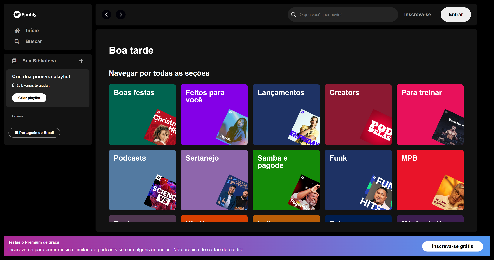

<h1 align="center">Web page do #spotify <em>(em desenvolvimento)<em></h1>

## 📋 Descrição do projeto

A <em>Web page</em> está sendo desenvolvida a partir da <em>home page</em> do #spotify, a qual possui tamanhos, cores, disposição e conteúdos semelhantes. O desenvolvimento desta página tem o propósito de colocar em prática os conhecimentos em <em><strong>HTML</strong></em>, <em><strong>CSS</strong></em> e <em><strong>JavaScript</strong></em>.

- O projeto foi desenvolvido durante a imersão Front-end da <a href="https://www.alura.com.br/">@Alura</a>.

> HTML:
- Tags de texto;
- Tags semânticas;
- Classes e Ids;
- Utilização de rede de entrega de conteúdo (CDN).
 
> CSS:
- Seletores;
- Pseudo-classes;
- Variáveis;
- Propriedades de posicionamento; 
- Utilização de vários arquivos .css;
- Modo de exibição dos elementos;
- Propriedades de alinhamento e espaçamento;
- Propriedades responsivas.

> Protótipo:

🔗 [Clique aqui para acessar](https://nathxrz.github.io/imersao-alura-front-end/)
 

## 🛠️ Tecnologias
- HTML
- CSS

## 📩 Contato
> 📧 nathyrezendemachado@gmail.com  
> 💼 <a href="https://www.linkedin.com/in/nathalia-machado-021b1b230/"> LinkedIn</a>  

    